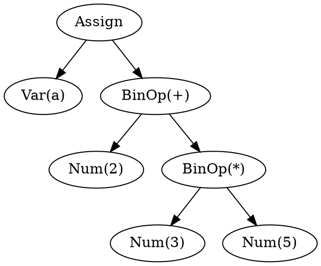
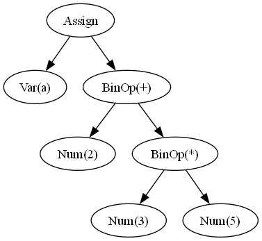

# Lab Practice — Building an AST for Assignment + Arithmetic Expressions

Extends the calculator (`../CalcLexer.py` / `../CalcParser.py`) in exactly one way: instead of
*evaluating* an expression to a number, the parser now *builds a tree* representing it — an
Abstract Syntax Tree (AST) — and adds simple assignment (`ID = expr`) on top of plain arithmetic.
source code files: `ExprAstLexer.py`, `ExprAstParser.py`, `ast_nodes.py`.

## 1. What is an AST?

An **Abstract Syntax Tree (AST)** is a tree representation of the syntactic structure of a program.

Each node represents a construct in the program.

For example:

```text
x = a + b * c
```


The corresponding AST is:

```text
        =
       / \
      x   +
         / \
        a   *
           / \
          b   c
```

The tree clearly shows that multiplication is performed before addition.

---

## What changed from the calculator

- **Lexer** (`ExprAstLexer.py`): adds `ID` (`[A-Za-z_][A-Za-z0-9_]*`) and the `=` literal, on
  top of the calculator's `NUMBER` and `{+, -, *, /, %}`.
- **Grammar** (`ExprAstParser.py`): adds one new top rule, `A -> ID "=" E`, for assignment.
  Every other rule (`E`, `T`, `F`) has the *same shape* as the calculator's — same three-layer
  precedence structure — but each action now **returns an AST node** (`BinOp`, `Num`, `Var`,
  `Assign`) instead of a computed number. Compare `T -> T "*" F` here
  (`return BinOp('*', value[0], value[2])`) against the calculator's identical rule
  (`return value[0] * value[2]`) to see the one-line difference this represents.

## The AST node design (`ast_nodes.py`)

Every node implements just two methods:
- `label()` — one-line display text (e.g. `"BinOp(+)"`, `"Num(5)"`)
- `children()` — list of child nodes (empty for leaves like `Num`/`Var`)

`pretty()` and `to_dot()` are generic tree-walkers built once on top of those two methods, so
every node type's printed and exported form stays consistent automatically

**This exact design is reused for TinyCStr starting Week 3** 

## The DOT language, briefly

[Graphviz DOT](https://graphviz.org/doc/info/lang.html) is a small text language for describing
graphs, which the `dot` command-line tool then lays out and renders as an image. The whole
language you need for AST diagrams is three kinds of line:

```dot
digraph AST {
  n0 [label="Assign"];
  n1 [label="Var(a)"];
  n0 -> n1;
  ...
}
```

- `digraph AST { ... }` — declares a *directed* graph named `AST`; everything else goes inside
  the braces.
- `n0 [label="Assign"];` — declares a node with internal id `n0` and display text `"Assign"`.
  The id (`n0`, `n1`, ...) is just an internal handle — only `label` is shown in the rendered
  image.
- `n0 -> n1;` — a directed edge from node `n0` to node `n1` (parent → child, here).

`to_dot()` in `ast_nodes.py` generates exactly this, walking the tree and assigning each node a
fresh `n<counter>` id as it goes, writing the result straight to a file (`ast.dot` by default).

## Worked example: `a = 2 + 3 * 5`

Running `ExprAstParser.py`'s bottom section (`inp = 'a=2+3*5'`) produces this AST — note `*`
binds tighter than `+` even though there's no explicit `precedence` table here either, for the
same structural reason as the calculator (`T` nests inside `E`):

```
Assign
  Var(a)
  BinOp(+)
    Num(2)
    BinOp(*)
      Num(3)
      Num(5)
```

The actual generated `ast.dot`:



Rendered (`dot -Tpng ast.dot -o ast.png`):



Read bottom-up: the `*` subtree (`Num(3)`, `Num(5)`) is fully nested one level inside the `+`
subtree, which is exactly what "multiplication binds tighter than addition" looks like as a
tree — `3 * 5` is computed as one unit before being added to `2`, and the whole sum is what gets
assigned to `a`.

## Running it

```bash
python ExprAstParser.py
```
parses `a=2+3*5`, prints the `pretty()` text form to stdout, and writes `ast.dot` via
`to_dot(result)`. Render it yourself with:
```bash
dot -Tpng ast.dot -o ast.png
```
(requires the Graphviz `dot` command-line tool — install via your OS package manager, e.g.
`apt install graphviz` or install from https://graphviz.org/download/ ).

Try other inputs by editing `inp` at the bottom of `ExprAstParser.py` — e.g. `b=1*2/3` 


