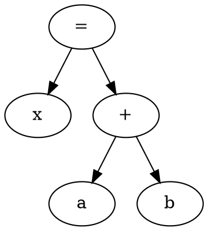
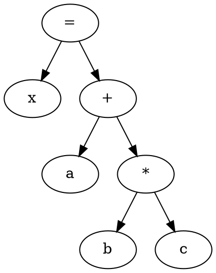

# Constructing an Abstract Syntax Tree (AST)

This lab practice focuses on constructing an **Abstract Syntax Tree (AST)** for simple assignment statements containing arithmetic expressions.

For example:

```text
x = a + b * c
```

The AST represents the hierarchical structure of the expression while ignoring unnecessary syntactic details.

The corresponding AST is:

```text
        =
       / \
      x   +
         / \
        a   *
           / \
          b   c
```

The tree clearly shows that multiplication is performed before addition.

---

## 1. What is an AST?

An **Abstract Syntax Tree (AST)** is a tree representation of the syntactic structure of a program.

Each node represents a construct in the program.

For example:

```text
x = a + b * c
```

can be represented as:

```text
Assignment
├── x
└── +
    ├── a
    └── *
        ├── b
        └── c
```

The AST captures the essential structure of the program and removes unnecessary details such as parentheses and other syntactic elements.

---

## 2. Graphviz DOT Language

The AST can be visualized using **Graphviz**. Graphviz uses a simple graph description language called **DOT**.

A directed graph is specified using:

```dot
digraph AST {
    ...
}
```

Here:

* `digraph` specifies a **directed graph**.
* `AST` is the name of the graph.
* Nodes represent AST elements.
* Directed edges represent relationships between parent and child nodes.

### Example

The following DOT code represents:

```text
x = a + b
```



The resulting graph is conceptually:

```text
      =
     / \
    x   +
       / \
      a   b
```

---

## 3. AST for an Assignment with an Arithmetic Expression

Consider the statement:

```text
x = a + b * c
```

The AST can be represented using the following DOT description:



This produces an AST similar to:

```text
        =
       / \
      x   +
         / \
        a   *
           / \
          b   c
```

The tree structure shows the precedence of arithmetic operators. The `*` node is deeper in the tree than the `+` node, indicating that `b * c` is evaluated before `a + ...`.

---

## 4. Viewing the AST

The DOT description can be saved in a file, for example:

```text
ast.dot
```

The AST image can then be generated using Graphviz:

```bash
dot -Tpng ast.dot -o ast.png
```

The generated `ast.png` file can be opened to visualize the AST.

---

## 5. Practice Problem

Construct an AST for a simple assignment statement containing an arithmetic expression.

For example:

```text
result = a + b * c
```

Identify:

1. The assignment operator.
2. The variable being assigned.
3. The arithmetic operators.
4. The operands.
5. The parent-child relationships in the AST.

Then represent the AST using **Graphviz DOT language** and generate the corresponding diagram.

### Expected AST Structure

```text
          =
        /   \
    result    +
             / \
            a   *
               / \
              b   c
```

The objective of this exercise is to understand how a source-level arithmetic expression can be represented as a tree structure and visualized using Graphviz.
